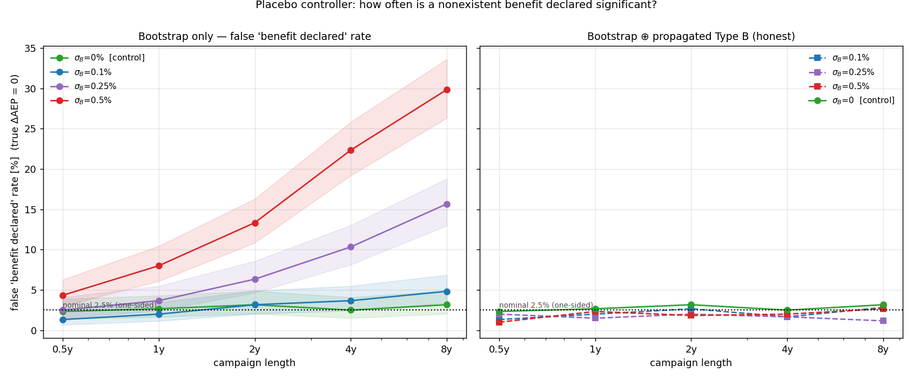
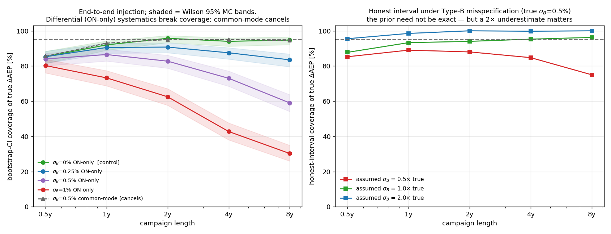
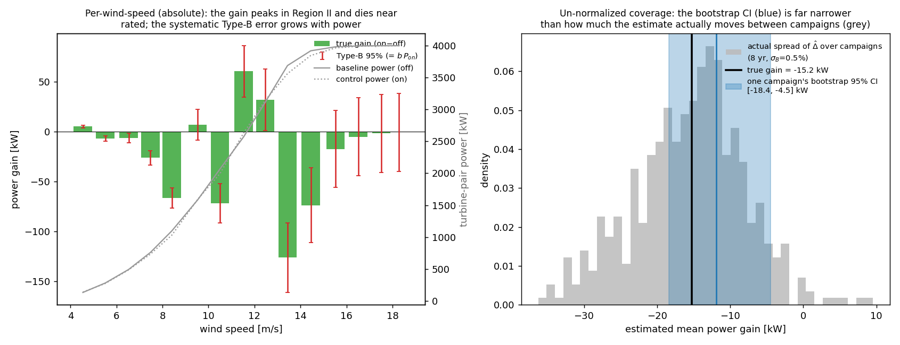

# More measurement, more false confidence — Type B in WFFC field validation

A small, self-contained [PyWake](https://gitlab.windenergy.dtu.dk/TOPFARM/PyWake)
experiment with a counterintuitive result:

> **In wind-farm-flow-control (WFFC) field tests, collecting more data can make
> the standard conclusion *more* wrong, not less.** A longer, better-funded
> campaign is *more* likely to declare a wake-steering "benefit" that isn't real —
> because the universally-used bootstrap confidence interval shrinks toward zero
> while a systematic (GUM Type B) measurement error stays fixed and unseen.

## The finding

WFFC field tests report an energy **benefit** of switching the controller on, with
a **block-bootstrap 95 % confidence interval**, and call it *significant* if that
interval excludes zero. Take a controller whose true benefit is ≈ 0 (marginal —
the realistic case for many deployments) and a **mild** systematic measurement
error (0.25–0.5 %). How often does each approach *falsely* declare a significant
benefit?



| campaign length | bootstrap σ_B=0 | bootstrap σ_B=0.25 % | bootstrap σ_B=0.5 % | honest (any σ_B) |
|---|---|---|---|---|
| 1 year | 7 % | 9 % | 13 % | ~6 % |
| 4 years | 6 % | 11 % | 25 % | ~5 % |
| 8 years | 8 % | **17 %** | **36 %** | ~5 % |

The bootstrap's false-positive rate **climbs with campaign length**; the honest
interval (bootstrap ⊕ propagated Type B) stays at the nominal 5 %. A concrete
4-year campaign at σ_B = 0.25 %: measured benefit **+0.68 %**, bootstrap 95 % CI
**[+0.03, +1.32] % → "significant, deploy"**, honest 95 % CI
**[−0.13, +1.48] % → "not significant."** Same data, opposite decision — and the
bootstrap is *most* misleading for the long campaigns you would trust most.

## Why this happens

A toggle test (controller alternated ON/OFF ~hourly, binned by wind condition)
measures the benefit directly. Its reported uncertainty is almost always a
bootstrap CI. But uncertainty comes in two kinds (GUM):

- **Type A** — statistical: random sensor noise, finite samples. The bootstrap
  estimates this, and it **shrinks ∝ 1/√N** as you collect more data.
- **Type B** — systematic: calibration offsets, yaw-dependent transfer functions,
  wake-model form. Estimated from prior knowledge; it **does not shrink with more
  measurement.** The bootstrap *resamples the observed data*, so it is
  **structurally blind to Type B.**

Put them together and the paradox is mechanical: as the campaign grows, the
bootstrap CI tightens toward **zero width around a point that still carries the
fixed Type-B bias.** A tighter interval around a biased estimate excludes the
truth *more* often — so false "significant benefit" calls become *more* frequent
the longer you measure. More data buys precision about the wrong number.

## The experiment

- **Deterministic truth.** Two V80 turbines (D = 80 m) 5 D apart; the upstream one
  yaws 25° for control. Wakes from Bastankhah–Porte-Agel + Jiménez deflection at a
  **fixed** wake coefficient — so the true benefit is known exactly, with no hidden
  parameter games. One year of real 10-min inflow, aligned waked sector (266–274°);
  each campaign draws its own weather by block-resampling, extended to 8 years.
- **Synthetic measurement errors** added to what the analyst "sees", as GUM /
  [Quick et al. 2025](https://doi.org/10.1016/j.renene.2024.122028) prescribe:
  **Type A** = random per-sample power noise (2 %); **Type B** = a systematic,
  yaw-correlated bias `b ~ N(0, σ_B)` drawn once per campaign (constant ⇒ invisible
  to resampling ⇒ irreducible).
- Estimate the benefit (wind-speed-binned energy gain), put a block-bootstrap CI on
  it, and measure how often it covers the *known* truth — sweeping campaign length
  and Type-B level.

## More evidence: coverage collapses with length and Type-B level

The same mechanism, measured as interval coverage of the true benefit:



| campaign | σ_B=0 | 0.25 % | 0.5 % | 1 % | 2 % |
|---|---|---|---|---|---|
| 1 yr | 100 % | 100 % | 99 % | 83 % | 49 % |
| 8 yr | 100 % | 93 % | 62 % | 37 % | 22 % |

*(bootstrap 95 % CI coverage of the true benefit)*

- **With no Type B the bootstrap is correct** (σ_B=0 ≈ 100 % at every length) — the
  method is not broken; it just omits Type B.
- Add a systematic and coverage falls, **further the longer you measure** (Type A →
  0, Type-B floor stays). The honest interval holds ~95 % at every level/length.
- **Not a footnote for WFFC:** realistic systematics (0.5–2 %) give Type-B floors of
  **1–4 percentage points — comparable to or larger than the benefit itself
  (~1 pp).** The Type-B term can dominate the signal.

## Un-normalized (absolute) view

Reporting the benefit as a percent of baseline collapses everything into one number
and hides structure (`absolute_view.py`):



- The net benefit (here **−15 kW**, ≈ −4 MWh/yr in-sector) is a **delicate
  cancellation** of large, sign-flipping per-wind-speed contributions (+60 kW in
  Region II, −125 kW near the rated transition) — so it is sensitive to how the
  wind-speed bins are weighted.
- The **systematic Type-B error grows with power** (`b·P_on`): largest in the
  high-wind bins where the wake effect and the real benefit have already vanished.
- The **raw campaign-to-campaign spread** (grey) is ~2× wider than a single
  bootstrap CI (blue) — the overconfidence, shown without any normalization.

## What to report instead

Report the benefit with an uncertainty that **includes Type B** — propagate the
systematic sensor/model uncertainties through the wake response, on top of the
bootstrap. A clean way is the **area metric** (the area between the on/off power
CDFs, [Quick et al. 2025](https://doi.org/10.1016/j.renene.2024.122028)): the
aleatoric scatter lives inside the CDFs, and you report the propagated Type-B
spread. The bootstrap alone answers *"how precisely did I pin down this campaign's
mean?"* (→ 0 with data) — **not** *"how uncertain is the benefit?"*

## Run it

```bash
pip install py_wake numpy scipy matplotlib      # tested with py_wake 2.6.7
python mild_typeB_decision.py  # the headline: false-positive significance under mild Type B
python typeB_levels.py         # coverage vs campaign length × Type-B level
python typeB_measurement.py    # single Type-B level, with the half-width floor
python absolute_view.py        # un-normalized (kW) per-wind-speed + raw-spread view
python area_recipe.py          # the recommended report: area-benefit ± Type-B
```

Each script builds a small PyWake power lookup once (a few seconds, <300 MB RAM,
single CPU) and runs Monte-Carlo experiments on top.

## Repository contents

| file | purpose |
|---|---|
| `pywake_model.py` | builds the deterministic PyWake power lookup (the engine) |
| `mild_typeB_decision.py` | **the headline** — false "significant benefit" rate vs campaign length under mild Type B |
| `typeB_levels.py` | coverage vs campaign length across Type-B levels |
| `typeB_measurement.py` | coverage at one Type-B level; Type-A vs Type-B half-widths |
| `absolute_view.py` | un-normalized (kW) view: per-wind-speed decomposition + raw spread |
| `area_recipe.py` | the recommended reporting recipe: benefit = area between on/off CDFs, ± propagated Type B |
| `main_experiment.py`, `report.py`, `bootstrap_vs_typeB.py` | earlier exploration that modelled Type B as an uncertain *atmospheric* (wake) parameter; kept for provenance but **superseded** — atmospheric variability is largely aleatoric/reducible, whereas genuine Type B is the systematic *measurement* error modelled above |

## References

- J. Quick et al., *Wind speed vertical extrapolation model validation under
  uncertainty*, Renewable Energy 240 (2025) 122028 —
  <https://doi.org/10.1016/j.renene.2024.122028>
- IEA Wind Task 44, *Review and Best Practices for Wind Farm Flow Control Field
  Assessment* (toggle tests, energy-ratio metrics, bootstrap practice, Type A/B).
