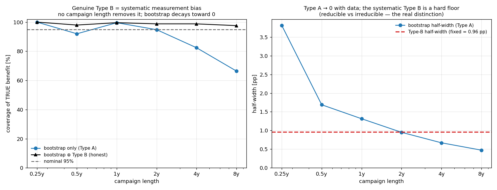

# Wind-farm-control field validation: the bootstrap CI is only half the uncertainty

A small, self-contained [PyWake](https://gitlab.windenergy.dtu.dk/TOPFARM/PyWake)
experiment showing why the confidence interval reported in essentially every
wind-farm-flow-control (WFFC) field study is **overconfident** — and what to
report instead.

## Background (for readers new to this)

**Wind-farm flow control / wake steering.** Yawing an upstream turbine deflects
its wake off a downstream turbine. The upstream turbine loses a little power, the
downstream one gains more, and the *wind farm* can come out ahead. The headline
number is the **energy benefit** of turning control on — typically a **1–3 %**
uplift.

**How it's measured — the toggle test.** Operators alternate the controller
ON/OFF every ~hour (50/50), bin the data by wind speed/direction, and compare
on vs off power. The reported uncertainty on the benefit is almost always a
**block bootstrap 95 % confidence interval** (Fleming, Doekemeijer, Simley,
Howland, … — see [IEA Wind Task 44 WP2](https://iea-wind.org/task44/)).

**Two kinds of uncertainty (GUM).** *Type A* is statistical — it comes from the
scatter in the data and **shrinks as you collect more** (random sensor noise,
finite samples). *Type B* is systematic — calibration offsets, yaw-dependent
transfer functions, wake-model form — it is estimated from prior knowledge and
**does not shrink with more measurement**. The bootstrap is a Type-A method: it
resamples the observed data, so it is **structurally blind to Type B**.

**The question this repo answers:** is the bootstrap CI an adequate uncertainty
on the WFFC benefit? If a systematic measurement error is present, does more data
fix it?

## The experiment

- **Deterministic truth.** Two V80 turbines (D = 80 m) 5 D apart; the upstream one
  yaws 25° for control. Wakes from Bastankhah–Porte-Agel + Jiménez deflection at a
  **fixed** wake-expansion coefficient — so the true benefit is known exactly and
  there are no hidden parameter games. One year of real 10-min inflow, filtered to
  the aligned waked sector (266–274°), tiled to multiple years.
- **Synthetic measurement errors** are added to what the analyst "sees", exactly
  as GUM / [Quick et al. 2025](https://doi.org/10.1016/j.renene.2024.122028)
  prescribe:
  - **Type A** — random per-sample power noise (2 %). Reducible by averaging.
  - **Type B** — a **systematic, yaw-correlated** bias drawn once per campaign,
    `b ~ N(0, σ_B)` (an uncorrected offset between the control and baseline states
    — a yaw-dependent power/anemometer error, straight off the IEA source list).
    Constant over the campaign ⇒ invisible to resampling ⇒ **irreducible**.
- **Procedure.** Estimate the benefit (wind-speed-binned energy gain), put a block
  bootstrap CI on it, and measure how often that interval actually contains the
  *known true benefit* — sweeping campaign length (3 months → 8 years) and the
  Type-B level (σ_B = 0 … 2 %).

## Findings


1. **With no Type B, the bootstrap is correct** (green, ~100 % coverage at every
   length). The method is not broken — the problem is *only* that it omits Type B.
2. **Add a systematic error and coverage collapses — and gets worse the longer
   you measure.** Type A shrinks toward 0 while the systematic floor stays fixed,
   so the tightening CI increasingly excludes the truth. The more you invest, the
   more overconfident the report becomes.

   | campaign | σ_B=0 | 0.25 % | 0.5 % | 1 % | 2 % |
   |---|---|---|---|---|---|
   | 1 yr | 100 % | 100 % | 99 % | 83 % | 49 % |
   | 8 yr | 100 % | 93 % | 62 % | 37 % | 22 % |

   *(coverage of the true benefit by the bootstrap 95 % CI)*

3. **The honest interval — bootstrap ⊕ propagated Type B — holds ~95 % at every
   level and length.** If you characterise the sensor/model systematics and
   propagate them, you are calibrated; if you only bootstrap, you are not.
4. **For WFFC this is not a footnote.** Realistic systematic measurement
   uncertainties (0.5–2 %) produce Type-B floors of **1–4 percentage points** —
   *comparable to or larger than the WFFC benefit itself* (~1 pp). The Type-B
   term can dominate the signal, and the bootstrap-only report is most misleading
   exactly for the marginal benefits typical in the field.



## Un-normalized (absolute) view

Reporting the benefit as a percent of baseline power collapses everything into one
number and hides structure. In absolute units (`absolute_view.py`):


- The net benefit (here **−15 kW**, ≈ −4 MWh/yr over the waked sector) is a
  **delicate cancellation** of large, sign-flipping per-wind-speed contributions
  (+60 kW in Region II, −125 kW near the rated transition where the yaw still
  costs power but the downstream turbine is already near rated). The aggregate is
  therefore sensitive to how the wind-speed bins are weighted — the percent number
  hides this entirely.
- The **systematic Type-B error grows with power** (`b·P_on`): tiny in low winds,
  ±40–50 kW near rated — i.e. largest in exactly the high-wind bins where the wake
  effect and the real benefit have vanished. A yaw-correlated metering bias thus
  contaminates the aggregate mainly through high-power, zero-benefit bins.
- The **raw campaign-to-campaign spread** of the estimate (grey histogram) is
  ~2× wider than a single campaign's bootstrap CI (blue) and off-centre from the
  truth — the same overconfidence as the normalized analysis, shown without any
  normalization.

## Different conclusions under *mild* Type B (`mild_typeB_decision.py`)

The field decision is binary: does the 95 % interval exclude zero — *"WFFC gives a
statistically significant benefit, deploy / publish"*? Set the true benefit to ≈0
(a marginal controller — the realistic WFFC case), give each campaign its own
weather (block-resampled), and count how often each method **falsely** declares a
significant benefit.


- With the Type-A bootstrap calibrated to ~5–7 % at σ_B = 0, even a **mild**
  systematic flips the conclusion. The bootstrap false-positive rate climbs with
  campaign length and Type-B level — to **17 % at σ_B = 0.25 %** and **36 % at
  σ_B = 0.5 %** by 8 years — while the honest (⊕ Type-B) interval stays ~5 %.
- A concrete 4-year campaign at σ_B = 0.25 %: measured benefit +0.68 %,
  **bootstrap** 95 % CI [+0.03, +1.32] % → *excludes 0 → "significant, deploy"*;
  **honest** 95 % CI [−0.13, +1.48] % → *includes 0 → "not significant"*. Same
  data, opposite go/no-go.
- It is worst for the campaigns you would trust most: a longer campaign shrinks
  the Type-A CI but not the systematic, so the most-invested studies are the most
  likely to "discover" a benefit that is not there.

## Takeaway

Report the WFFC benefit with an uncertainty that **includes Type B** —
propagate the systematic sensor/model uncertainties through the wake response,
on top of the bootstrap. A clean way to do this is the **area metric** (the area
between the on/off power CDFs, [Quick et al. 2025](https://doi.org/10.1016/j.renene.2024.122028)):
the aleatoric scatter lives inside the CDFs, and you report the propagated Type-B
spread. The block bootstrap on its own answers *"how precisely did I pin down this
campaign's mean?"* — which correctly → 0 with data — not *"how uncertain is the
benefit?"*

## Run it

```bash
pip install py_wake numpy scipy matplotlib      # tested with py_wake 2.6.7
python typeB_levels.py         # headline: coverage vs campaign length × Type-B level
python typeB_measurement.py    # single Type-B level, with the half-width floor
python mild_typeB_decision.py  # significance go/no-go under mild Type B
python absolute_view.py        # un-normalized (kW) per-wind-speed + raw-spread view
python area_recipe.py          # the recommended report: area-benefit ± Type-B
```

Each script builds a small PyWake power lookup once (a few seconds, <300 MB RAM,
single CPU) and runs Monte-Carlo coverage experiments on top.

## Repository contents

| file | purpose |
|---|---|
| `pywake_model.py` | builds the deterministic PyWake power lookup (the engine) |
| `typeB_levels.py` | **main result** — coverage vs campaign length across Type-B levels |
| `typeB_measurement.py` | coverage vs campaign length at one Type-B level; Type-A/Type-B half-widths |
| `mild_typeB_decision.py` | go/no-go significance: false "significant benefit" rate under mild Type B |
| `absolute_view.py` | un-normalized (kW) view: per-wind-speed decomposition + raw campaign-to-campaign spread |
| `area_recipe.py` | the recommended reporting recipe: benefit = area between on/off CDFs, ± propagated Type B |
| `main_experiment.py`, `report.py`, `bootstrap_vs_typeB.py` | earlier exploration that modelled Type B as an uncertain *atmospheric* (wake) parameter; kept for provenance but **superseded** — atmospheric variability is largely aleatoric/reducible, whereas genuine Type B is the systematic *measurement* error modelled above |

## References

- J. Quick et al., *Wind speed vertical extrapolation model validation under
  uncertainty*, Renewable Energy 240 (2025) 122028 —
  <https://doi.org/10.1016/j.renene.2024.122028> (the validation framework and the
  area metric / Type-A vs Type-B treatment).
- IEA Wind Task 44, *Review and Best Practices for Wind Farm Flow Control Field
  Assessment* (toggle tests, energy-ratio metrics, bootstrap practice, Type A/B
  discussion).
