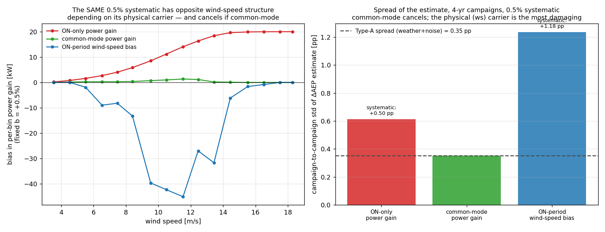
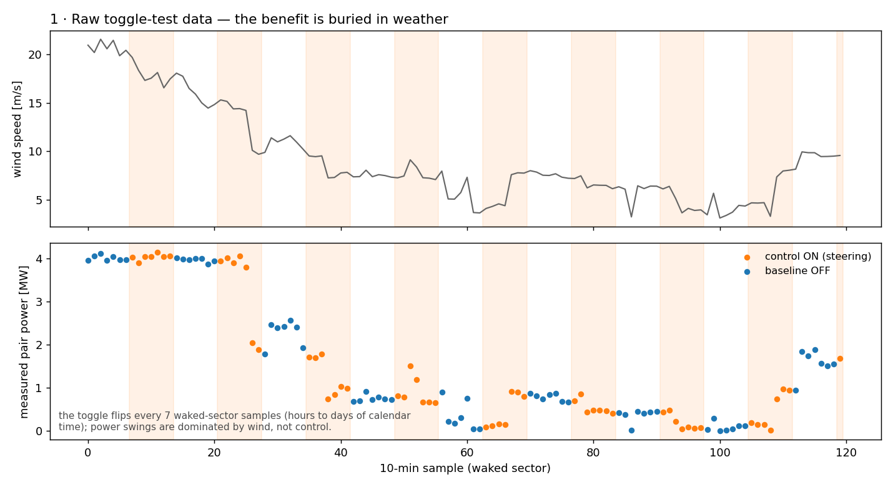
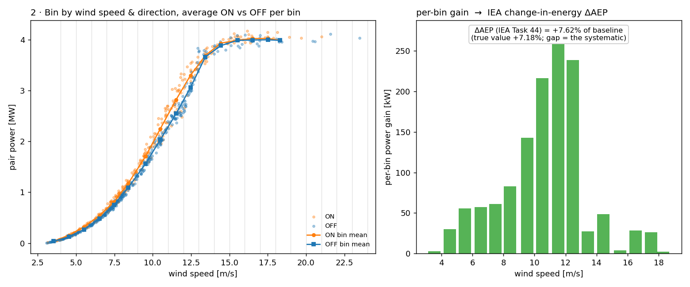
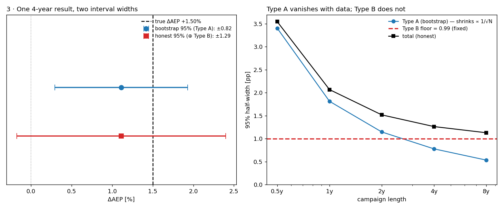
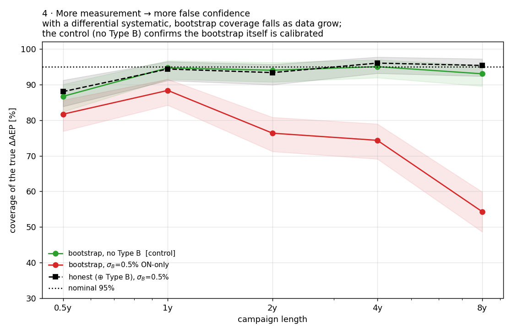

# The cost of omitting Type B in WFFC field validation

A self-contained [PyWake](https://gitlab.windenergy.dtu.dk/TOPFARM/PyWake)
experiment quantifying a specific, decision-level failure mode in
wind-farm-flow-control (WFFC) field assessment:

> A block-bootstrap confidence interval on the measured energy benefit captures
> only the **statistical (GUM Type A)** uncertainty. If a **systematic
> differential (Type B)** measurement error is present, the bootstrap interval
> shrinks with campaign length while the systematic does not — so the
> probability of declaring a *nonexistent* benefit "statistically significant"
> **grows** as more data are collected. We quantify that growth, show the
> repair (propagate Type B alongside the bootstrap), and show which kinds of
> systematics actually matter (differential ones; common-mode errors cancel in
> the toggle design).

This is deliberately *not* a claim that the bootstrap is wrong — with no
systematic present it is correctly calibrated here (the control arms sit on
their nominal levels). It quantifies the cost of stopping there.

## What current practice reports

Toggle-test field studies overwhelmingly quantify uncertainty on the
energy-uplift metric with resampling: Fleming et al. (2019), Doekemeijer et
al. (2021), Simley et al. (2021), Fleming et al. (2021), Simley et al. (2022)
and Howland et al. (2022) all report bootstrap 95 % confidence intervals on
power/energy ratios. The forthcoming
[IEA Wind Task 44](https://iea-wind.org/task44/) field-assessment review (in
preparation, targeted at *Wind Energy Science*) catalogues this practice; the
pattern is that when uncertainty is reported at all, the large majority of
papers report only statistical (Type A) uncertainty. The notable exception is
Kanev (2020), whose TNO validation-methodology report propagates Type-B sensor
uncertainties following the GUM / IEC 61400-12-2.
The underlying mechanism — a frozen systematic eventually swamping a sampling
variance that shrinks like 1/√N — is an elementary GUM corollary, and the repair
is standard GUM/Kanev propagation, not a new estimator. The contribution here is
not "Type B exists" or a novel phenomenon; it is the **WFFC-specific
quantification of how the omission scales with campaign length at the go/no-go
decision level, a comparison of which physical carriers actually survive the
toggle design (Result 1), and the sensitivity coefficients needed to repair
each.**

## Read this first: the metric, the errors, and the truth

**Metric.** The IEA Task 44 change-in-energy metric (as formalized in the
in-preparation Task 44 field-assessment review; `metrics.py`), 2-D binned by
wind direction × wind speed with occurrence weights:

```
ΔAEP = Σ_ij w_ij ( P̄_on,ij − P̄_off,ij ) / Σ_ij w_ij P̄_off,ij
```

The denominator is baseline power — nothing is ever normalized by the true
benefit.

**Physics (fixed, not tuned).** Two V80s 5 D apart; the upstream turbine steers
with a realistic schedule γ(wd, ws) = 25°·sign(wd−270°), tapering linearly to
zero between 11 and 13 m/s (controllers stop steering approaching rated).
Bastankhah–Porte-Agel + Jiménez at the PyWake-default wake coefficient
k = 0.0325 for **every** experiment (not tuned per-experiment). The resulting
true benefit is a **waked-sector energy uplift of ΔAEP = +7.2 %** for this
close-spaced, ideally-steered pair — i.e. +7.2 % *of the baseline energy in the
266–274° sector* (the canonical IEA Task 44 change-in-energy quantity), which is ~3 % of annual
hours, so the implied full-rose annual gain is ≈0.2 %; "ΔAEP" here is the
sector-conditional metric, not a farm-annual number. The magnitude is conditional
on the fixed k: sweeping k across PyWake's plausible range (0.018–0.052) moves it
from +18 % to +0.2 %, so we pin k at the model default rather than dial a
headline. **Crucially, none of the Type-B conclusions depend on this magnitude:**
the ON-only sensitivity dΔAEP/db = 100 + ΔAEP varies only from 100 to ~118 across
that whole k range, and the placebo decision experiment (Result 2) has true
ΔAEP = 0 exactly — so the false-positive mechanism is essentially independent of
the true benefit's size. One year of real 10-min Risø inflow, aligned sector
266–274°; campaigns are built by resampling 2-day blocks (a disclosed idealization
— see Limitations).

**Truth.** The estimand is the deterministic clean ΔAEP on a fixed,
length-independent bin set (both control states evaluated from the wake model
on all samples — no toggle noise, no bin-mask drift). For the null experiments
we use a **placebo toggle** (control ON does nothing physically), making the
true benefit *exactly zero by construction* — no parameter tuning. (Fine print:
the campaign *estimator* is toggle-split — it averages ON-only and OFF-only
samples per bin — so it differs from this all-sample estimand by a small
within-bin composition offset, +0.02 pp on the real controller and +0.05 pp on
the placebo, that decays with campaign length. This offset is a fixed property
of the estimator, not of the systematic; it is carried in the σ_B = 0 control
column, which is why the reported effects are always *excess over that control*
rather than raw rates.)

**Synthetic measurement errors** (injected end-to-end into the observed power):

- **Type A** — every logged power × (1 + ε), ε ~ N(0, 2 %) i.i.d. per sample.
  Random; averages out; exactly what the bootstrap measures.
- **Type B** — a gain (1 + b), b ~ N(0, σ_B), drawn **once per campaign** and
  constant throughout: *irreducible by collecting more of the same data* (it
  could of course be removed by better calibration — that is the other honest
  remedy). Three carriers are compared: applied to ON-periods only
  (differential), to both states (common-mode), or to the ON-period *measured
  wind speed* used for binning (the physical carrier of a yaw-dependent
  transfer-function error).

## Result 1 — which systematics matter (`carrier_typeB.py`)



- **Common-mode errors cancel exactly.** The change-in-energy metric is
  invariant to a gain applied to both states — this is the toggle design's real
  strength, and it means ordinary absolute power-measurement uncertainty
  (0.5–2 %) largely does *not* threaten the result.
- **Differential errors survive.** A 0.5 % ON-only power gain adds ±0.50 pp of
  campaign-to-campaign systematic spread (analytically dΔAEP/db = 100 + ΔAEP).
- **The physically-motivated carrier is the worst.** A 0.5 % yaw-dependent bias
  on the *measured wind speed* (bin migration) contributes ±1.19 pp — larger
  than the power-gain carrier, with the opposite wind-speed structure
  (concentrated in Region II where the power curve is steep, ~zero at rated).
  Where the systematic enters matters as much as its size.

## Result 2 — the go/no-go decision under mild Type B (`mild_typeB_decision.py`)

Placebo controller (true ΔAEP = 0 exactly). How often does each report declare
a benefit (one-sided: 95 % CI lower bound > 0)?


| campaign | σ_B=0 (control) | 0.1 % | 0.25 % | 0.5 % |
|---|---|---|---|---|
| 1 yr | 2.7 % | 2.0 % | 3.7 % | 8.0 % |
| 4 yr | 2.5 % | 3.7 % | 10.3 % | 22.3 % |
| 8 yr | 3.2 % | 4.8 % | **15.7 %** | **29.8 %** |

*(nominal 2.5 %; R = 600 campaigns per cell, Wilson bands in the figure; the
honest interval — bootstrap ⊕ propagated Type B — stays at 1–3 % everywhere.)*

The control column shows the bootstrap itself is calibrated at every length;
the growth across each row is therefore attributable to the omitted
systematic. The growth is monotone but **bounded**: as L → ∞ the bootstrap
half-width → 0, so this one-sided "benefit declared" rate approaches
P(b > 0) = **50 %** (and the two-sided "change declared" rate → 100 %) for a
symmetric Type-B prior — the tables show the approach to that ceiling, not an
unbounded blow-up. Concrete exemplar (4 yr, σ_B = 0.25 %, true benefit zero):
measured ΔAEP +0.44 %, **bootstrap** CI [+0.02, +0.86] % → *benefit declared,
deploy*; **honest** CI [−0.21, +1.09] % → *not significant*. Same data,
opposite decision — and the failure rate is highest for the longest campaigns.

## Result 3 — coverage and the honest repair (`typeB_levels.py`)

Real controller (true ΔAEP = +7.2 %), end-to-end injection, coverage of the
true value by the bootstrap 95 % CI:


Excess coverage loss relative to the σ_B = 0 control:

| campaign | σ_B=0.25 % | 0.5 % | 1 % |
|---|---|---|---|
| 1 yr | +1.5 pp | +5.5 pp | +19 pp |
| 4 yr | +6.5 pp | +21 pp | +51 pp |
| 8 yr | +11 pp | +36 pp | +65 pp |

The common-mode arm tracks the control at every length (cancellation,
verified).

**The honest repair works — with two honesty caveats.** With the assumed σ_B
equal to truth, coverage is 93–96 % for campaigns ≥ 1 yr; a 2× overestimate is
safely conservative; a 2× *under*estimate degrades to ~75 % by 8 yr — the prior
matters, but it need not be exact. Two things this does *not* claim:

1. **The exactly-specified (1×) case is an analytic identity, not an empirical
   win.** For an ON-only gain the estimate shifts by exactly (dΔAEP/db)·b with
   b ~ N(0, σ_B), so adding z·(dΔAEP/db)·σ_B in quadrature with a calibrated
   bootstrap returns 95 % coverage *by construction* wherever the bootstrap is
   itself calibrated. The empirical content is the misspecification sweep, not
   the 1× column. (The sensitivity is taken per-campaign from the *measured*
   ΔAEP, not the oracle truth; the two agree to <0.4 pp.)
2. **"Coverage" here is prior-averaged (GUM-marginal).** It is the hit rate over
   the *ensemble* of campaigns drawn from the Type-B prior — not a guarantee for
   one deployed campaign, whose realized bias is a fixed unknown. The honest
   interval widens the band to the right size *on average*; it does not identify
   this campaign's particular offset.

**The repair is carrier-specific — and the naive version fails on the worst
carrier.** The term above uses the ON-only power-gain sensitivity
dΔAEP/db = 100 + ΔAEP ≈ 107. The ws (bin-migration) carrier — which Result 1
flags as the *worst* — has **no** such closed form; propagating a unit ws bias
through the metric gives a sensitivity S_ws ≈ 221, **2.1× larger**. On the ws
carrier at σ_B = 0.5 % (third panel of the figure):

| campaign | bootstrap only | honest, *naive* 107 term | honest, correct 221 term |
|---|---|---|---|
| 1 yr | 72 % | 82 % | 95 % |
| 4 yr | 39 % | 68 % | 95 % |
| 8 yr | **32 %** | **65 %** | **94 %** |

Reusing the ON-only term on a ws systematic under-corrects and leaves the same
length-scaling collapse (65 % at 8 yr); propagating the ws carrier's *own*
(numerically estimated) sensitivity restores coverage (94 %). The recipe is
therefore: propagate the *right* sensitivity for the *actual* carrier — a single
one-size term is not enough.

Calibration note: at 0.5 yr the block bootstrap itself undercovers (~85 %, a
small-sample limitation visible in the control arm) — which is why effects are
reported as excess over the control, and why even the correctly-repaired ws arm
reads 89 % at 0.5 yr. The placebo experiment, whose truth is exact, is
calibrated at all lengths.

## The visual story (`story.py`)

Raw toggle data → binning → the two uncertainties → the conclusion, in one
consistent scenario (fixed k, realistic controller, σ_B = 0.5 % ON-only):






## What to report

1. The block-bootstrap CI, as now — it is the right Type-A estimate.
2. **Plus a propagated Type-B term** for *differential* systematics
   (yaw-dependent transfer functions, ON/OFF-asymmetric sensor paths),
   combined in quadrature — the GUM approach demonstrated here, in the spirit
   of Kanev (2020) and of the validation framework of
   [Quick et al. (2025)](https://doi.org/10.1016/j.renene.2024.122028)
   (aleatoric variability lives in the data; epistemic uncertainty is
   propagated and reported). **Use the sensitivity of the *actual* carrier, not
   a one-size coefficient:** for an ON-only power gain it is dΔAEP/db = 100 +
   ΔAEP; for a yaw-dependent wind-speed/transfer-function bias it is ~2× larger
   and has no closed form — estimate it by pushing a unit bias through the
   metric pipeline (`ws_carrier_sensitivity` in `typeB_levels.py`). Result 3
   shows the naive ON-only term leaves the ws carrier under-covered (65 % at
   8 yr); its own sensitivity restores it (94 %).
3. Or, equivalently: invest in calibrating the differential channels away —
   the common-mode result shows the toggle design already protects against
   everything else.

## Limitations (disclosed idealizations)

- **One base year, block-resampled.** No interannual variability; the weather
  process satisfies the bootstrap's exchangeability assumptions by
  construction. Quantitative length-scalings are conditional on this; the
  qualitative mechanism (Type A shrinks, a constant systematic does not) is
  not.
- **b is constant for the whole campaign.** A systematic with a ~1-yr
  correlation time would partially average down; the monotone growth assumes
  the error persists (e.g., an uncorrected transfer function, which does).
- Single site, layout (2 turbines, 5 D), wake model, and toggle scheme
  (every 7 waked-sector samples ≈ hours-to-days of calendar time). The
  sensitivity dΔAEP/db = 100 + ΔAEP is exact for any of these choices; the
  weather-driven Type-A schedule is not.
- σ_A = 2 % i.i.d. is synthetic; real 10-min scatter is larger and correlated,
  which would slow (not remove) the Type-A shrinkage.

## Run it

```bash
pip install py_wake numpy scipy matplotlib      # tested with py_wake 2.6.7
python carrier_typeB.py        # which systematics matter (common-mode cancels)
python mild_typeB_decision.py  # false 'benefit declared' rate vs campaign length
python typeB_levels.py         # coverage, excess-over-control, misspecification
python story.py                # the 4-figure walkthrough
python absolute_view.py        # un-normalized (kW) per-wind-speed view
```

Shared modules: `pywake_model.py` (deterministic lookup, realistic yaw
schedule, fixed k), `metrics.py` (IEA Task 44 change-in-energy metric +
vectorized B=1000 block bootstrap + fixed-mask estimand), `campaigns.py` (block-resampled campaigns,
collision-free seeds, end-to-end error injection). Each script runs on a
laptop (<1 GB RAM, single CPU, minutes to ~half an hour).

`main_experiment.py`, `report.py`, `bootstrap_vs_typeB.py`,
`typeB_measurement.py`, `area_recipe.py` are earlier iterations kept for
provenance (an atmospheric-parameter Type-B framing and pre-rework metrics),
superseded by the above.

## References

- IEA Wind Task 44, *Review and Best Practices for Wind Farm Flow Control
  Field Assessment* — the change-in-energy metric, bootstrap practice, and the
  Type-A/Type-B discussion drawn on here. **In preparation** (targeted at *Wind
  Energy Science*); not yet a citable publication. Task homepage:
  <https://iea-wind.org/task44/>.
- J. Meyers, C. Bottasso, K. Dykes, P. Fleming, P. Gebraad, G. Giebel, T.
  Göçmen, J.-W. van Wingerden, *Wind farm flow control: prospects and
  challenges*, Wind Energy Science 7 (2022) 2271–2306 —
  <https://doi.org/10.5194/wes-7-2271-2022> (the published Task 44
  prospects-and-challenges review; the field-assessment review above is a
  separate, later document).
- J. Quick et al., *Wind speed vertical extrapolation model validation under
  uncertainty*, Renewable Energy 240 (2025) 122028 —
  <https://doi.org/10.1016/j.renene.2024.122028>.
- S. Kanev, *AWC validation methodology*, TNO report TNO 2020 R11300, Petten,
  Aug 2020 — GUM / IEC 61400-12-2 (Category A/B) uncertainty propagation for
  WFFC AEP assessment (the exception that proves the rule);
  <https://resolver.tno.nl/uuid:fdae4c94-fbcc-4337-b49f-5a39c93ef2cf>. (Cited
  as "Kanev (2020b)" elsewhere; the "a/b" suffixes are local labels — the
  companion *Renewable Energy* 146 (2020) 9–15 dynamic-wake-steering paper is
  the other 2020 Kanev item.)
- Fleming et al. (2019), Doekemeijer et al. (2021), Simley et al. (2021, 2022),
  Fleming et al. (2021), Howland et al. (2022) — field campaigns reporting
  bootstrap CIs on the uplift.
